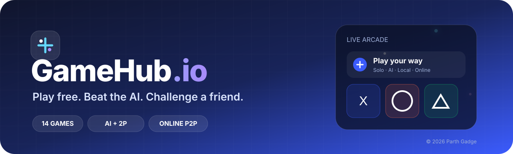
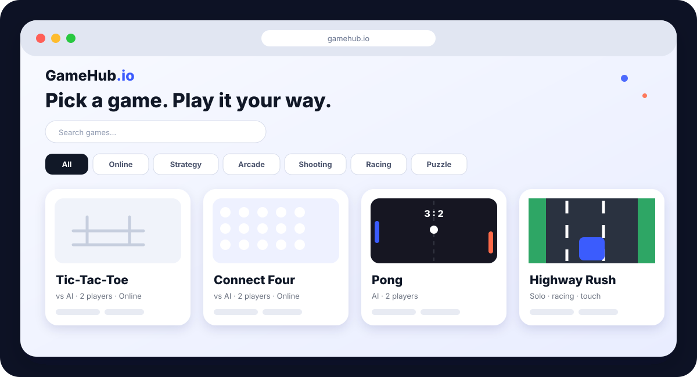
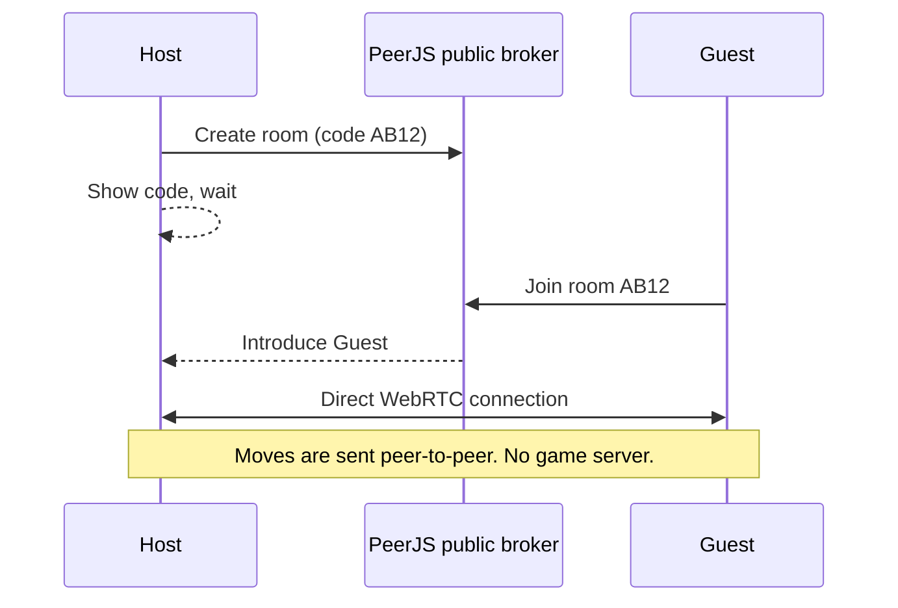

<div align="center">




**[▶ Play now]([https://YOUR-PROJECT.vercel.app](https://parthgadge2025.github.io/GameHub.io/))** · **[Report a bug](../../issues)** · **[Request a game](../../issues)**

</div>

---

## About

**GameHub.io** is a free browser game hub. Every game runs in one static page: no sign-up, no downloads, no server to pay for. Pick a game, then play it your way:

- 🤖 **Solo vs AI**: practice against a computer opponent
- 👥 **Two players, one PC**: share a keyboard or take turns on the same screen
- 🌐 **Online with a room code**: create a room, share the 4-letter code, and a friend joins from any device

The interface is a clean card grid with search, category tabs and a light/dark theme that follows your system.

<div align="center">

<br><sub>Animated preview of the interface: Tic-Tac-Toe, Connect Four, Pong and Highway Rush cards.</sub>
</div>

## Features

| | |
|---|---|
| 🎴 **Card grid** | Every game has an icon, a one-line pitch and mode tags |
| 🔎 **Search + tabs** | Filter by All, Online, Strategy, Arcade, Shooting, Racing, Puzzle, Simulator |
| 🌗 **Light / dark theme** | Follows your system and remembers your choice |
| 🌐 **Room-code multiplayer** | Peer-to-peer over WebRTC, so there is no game server |
| 💾 **Auto-save** | Coffee Shop Sim progress, Reaction Time and Space Shooter bests are stored in your browser |
| 📱 **Responsive** | Works on desktop and phones; racing and shooter games accept touch |
| ⌨️ **Accessible** | Keyboard focus outlines, labelled buttons, reduced-motion support, `Esc` closes a game |
| ⚡ **Zero build step** | One `index.html`, no frameworks, no dependencies except PeerJS (loaded only for online play) |

## Games

| # | Game | Category | Modes | How to play |
|---|------|----------|-------|-------------|
| 1 | ❌ **Tic-Tac-Toe** | Strategy | AI · 2P · Online | Click a cell and get three in a row. The AI uses minimax but makes occasional mistakes, so it can be beaten. |
| 2 | 🔴 **Connect Four** | Strategy | AI · 2P · Online | Click a column to drop a disc. Connect four horizontally, vertically or diagonally. |
| 3 | ✂️ **Rock Paper Scissors** | Strategy | AI · 2P · Online | Pick a move. On one PC, Player 1 picks first and Player 2 picks after (no peeking). Online picks are revealed together. |
| 4 | 🔲 **Dots & Boxes** | Strategy | AI · 2P · Online | Draw one line per turn. Closing a box scores it and gives you another move. The AI grabs boxes and avoids handing you a third side. |
| 5 | ✋ **Chopsticks** | Strategy | AI · 2P · Online | Select one of your hands, then tap an opponent's hand to add your fingers to theirs. A hand with 5 or more fingers is out. You can also **split** your fingers between your hands. Knock out both opposing hands to win. |
| 6 | 🏓 **Pong** | Arcade | AI · 2P | `W`/`S` moves Player 1, `↑`/`↓` moves Player 2. First to 7 wins. The ball speeds up on every hit. |
| 7 | 🐍 **Snake** | Arcade | Solo | Arrow keys or `WASD`. Eat the red squares, grow longer, and don't hit a wall or yourself. |
| 8 | ⚡ **Reaction Time** | Arcade | Solo | Wait for the screen to turn green, then click. Clicking early resets the round. Your best time is saved. |
| 9 | 🐹 **Whack-a-Mole** | Arcade | Solo | Click each mole as it pops up. You have 30 seconds. |
| 10 | 🚀 **Space Shooter** | Shooting | Solo | Steer with mouse, finger or `←` `→`. Your ship fires automatically. Invaders get faster as your score rises, and one reaching the bottom ends the run. |
| 11 | 🎯 **Target Practice** | Shooting | Solo | Click shrinking targets for 30 seconds. Smaller targets are worth more and a miss costs a point. |
| 12 | 🏎️ **Highway Rush** | Racing | Solo | Switch between three lanes with `←` `→` / `A` `D`, or tap the left or right side of the screen. Traffic gets faster the further you go. |
| 13 | 🧠 **Memory Match** | Puzzle | Solo · 2P | Flip cards to find all 8 pairs. Solo counts your moves; with two players you take turns and a match keeps your turn. |
| 14 | ☕ **Coffee Shop Sim** | Simulator | Solo | See below. |

### ☕ Coffee Shop Sim

A small business simulation played one day at a time.

- **Prices:** set your own for Espresso, Latte and Cappuccino. Charge far above the fair price and fewer customers buy.
- **Stock:** beans and milk run out. Empty shelves mean lost sales and a lower reputation.
- **Staff and gear:** hire up to 4 baristas (each adds capacity and a daily wage) and upgrade the grinder up to level 3 to serve more people and build reputation faster.
- **A real day:** the shop runs 8:00 to 19:00, with rush hours at 8, 9, 12, 13 and 17.
- **Weather:** sunny, rainy and cold days change how many people show up and what they order.
- **Running costs:** rent and wages are charged when you close. Run out of cash and you're in debt.
- **Progress** is saved automatically in your browser.

## How online play works



1. Open a game that has the 🌐 **Online** tag and choose **Play online with a room code**.
2. One player picks **Create room** and shares the 4-letter code.
3. The other player picks **Join**, types the code, and the match starts.

> Online mode needs both players to open the same game. Some school or office networks block WebRTC; if a connection fails, try another network or mobile data.

## Project structure

```
gamehub/
├── index.html          # the whole site: styles, games, UI
├── README.md
└── assets/
    ├── banner.svg      # animated typing banner
    └── preview.svg     # animated interface preview
```

## Run locally

```bash
# any static server works
npx serve .
# or just double-click index.html
```

## Deploy

**Vercel**
1. Push this folder to a GitHub repo.
2. In Vercel choose **Add New → Project** and import the repo.
3. Framework preset: **Other**. Leave the build command and output directory empty, then **Deploy**.

**GitHub Pages**
1. Repo **Settings → Pages**.
2. Source: **Deploy from a branch**, branch `main`, folder `/ (root)`.

## Add your own game

Every game is one entry in the `G` list inside `index.html`:

```js
{ n:'My Game', i:'🎲', c:'Arcade', m:['solo'], d:'One-line pitch.', s:myGame }

function myGame(root, mode, net){
  // build your UI inside `root`
  return () => { /* optional cleanup when the game closes */ };
}
```

- Modes are `solo`, `ai`, `duo` and `online`.
- Turn-based board games can reuse the built-in `turn()` engine: provide `init`, `legal`, `play`, `winner`, `render` and `ai`, and AI, same-PC and online play all work.

## Roadmap

- [x] Solo vs AI, same-PC and room-code online modes
- [x] Strategy, arcade, shooting, racing, puzzle and simulator categories
- [x] Light / dark theme
- [ ] More games (2048, Minesweeper, Tetris, Battleship, Checkers, trivia battle)
- [ ] More simulators (city builder, farm)
- [ ] Online play for Pong and real-time games
- [ ] Leaderboards

## Built with

HTML · CSS · vanilla JavaScript · Canvas · [PeerJS](https://peerjs.com/) for peer-to-peer online play · [Space Grotesk](https://fonts.google.com/specimen/Space+Grotesk) typeface

## Copyright

© 2026 **Parth Gadge**. All rights reserved.

<div align="center"><sub>Made with ❤️ by Parth Gadge · GameHub.io</sub></div>
