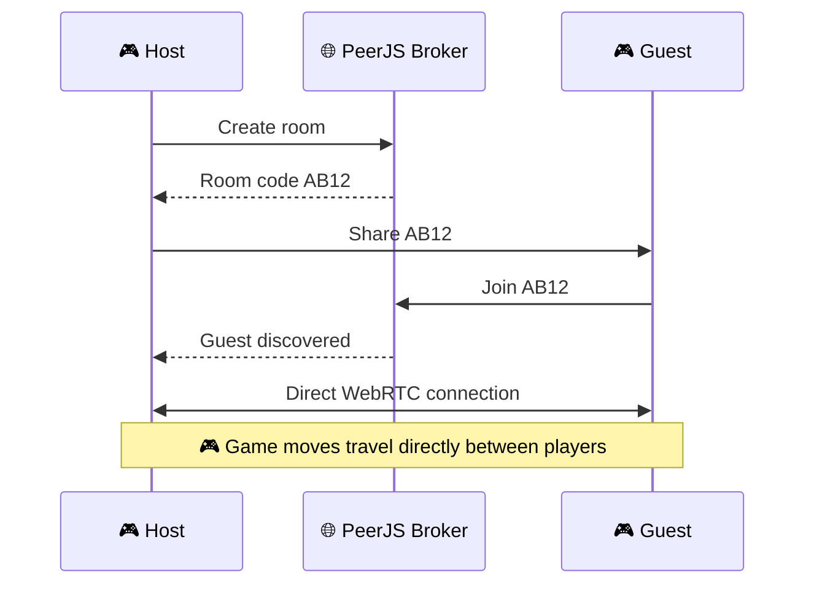

<div align="center">

<br>


<br>

# 🎮 GameHub.io

### **Play free. Beat the AI. Challenge a friend.**

A fast, beautiful and completely free browser game arcade packed with **14 games**, AI opponents, local multiplayer, online room-code matches and zero sign-up.

<br>

<a href="https://parthgadge2025.github.io/GameHub.io/">
  
</a>

<a href="../../issues">
  
</a>

<a href="../../issues">
  
</a>

<br><br>


<br>


<br><br>

> **No account. No downloads. No subscriptions. Just open the site and play.**

</div>

---

# 🚀 Welcome to GameHub.io

**GameHub.io** is a lightweight browser-based gaming platform built with vanilla web technologies.

It brings together classic strategy games, arcade challenges, shooters, racing games, puzzles and a business simulator into one interactive interface.

Whether you want to:

* 🤖 challenge an AI
* 👥 play with someone beside you
* 🌐 challenge a friend online
* 🏆 beat your personal best
* ☕ manage a virtual coffee shop
* ⚡ kill five minutes between classes

**GameHub.io has something to play.**

And the best part?

### **It's completely free.**

---

<div align="center">

## 🎮 ENTER THE ARCADE

### [▶️ **PLAY GAMEHUB.IO NOW**](https://parthgadge2025.github.io/GameHub.io/)

*No installation • No account • No waiting*

</div>

---

# ✨ What Makes GameHub Different?

| Feature               | GameHub.io            |
| --------------------- | --------------------- |
| 🎮 Games              | **14 playable games** |
| 🤖 AI opponents       | **Yes**               |
| 👥 Local multiplayer  | **Yes**               |
| 🌐 Online multiplayer | **Room-code P2P**     |
| 💾 Browser saves      | **Yes**               |
| 📱 Mobile support     | **Yes**               |
| 🌗 Dark / Light mode  | **Yes**               |
| 🔎 Search             | **Yes**               |
| 🏷️ Categories        | **Yes**               |
| ⌨️ Keyboard controls  | **Yes**               |
| ♿ Accessibility       | **Yes**               |
| 💰 Cost               | **Free**              |
| 🖥️ Backend           | **None required**     |
| ⚡ Build system        | **None**              |

---

# 🎬 See GameHub in Action

<div align="center">


<br>

### 🎮 Tic-Tac-Toe • Connect Four • Pong • Highway Rush

*Animated preview of the GameHub.io arcade interface.*

</div>

---

# 🕹️ The Games

## 🧠 Strategy

### 1. ❌ Tic-Tac-Toe

Classic three-in-a-row with a surprisingly capable AI.

**Modes:** 🤖 AI · 👥 2P · 🌐 Online

* Minimax-powered AI
* Same-PC multiplayer
* Online room-code matches
* AI occasionally makes mistakes so you can actually beat it

---

### 2. 🔴 Connect Four

Drop discs, create traps and connect four before your opponent does.

**Modes:** 🤖 AI · 👥 2P · 🌐 Online

---

### 3. ✂️ Rock Paper Scissors

The classic battle of:

**Rock 🪨 vs Paper 📄 vs Scissors ✂️**

**Modes:** 🤖 AI · 👥 2P · 🌐 Online

Local multiplayer prevents peeking, while online selections are revealed simultaneously.

---

### 4. 🔲 Dots & Boxes

Draw lines, complete boxes and force your opponent into traps.

**Modes:** 🤖 AI · 👥 2P · 🌐 Online

Closing a box gives you another move, making every line important.

---

### 5. ✋ Chopsticks

A strategic hand game where every finger matters.

**Modes:** 🤖 AI · 👥 2P · 🌐 Online

Features:

* Hand attacks
* Knockouts
* Splitting
* Tactical decision making
* AI opponent

---

# 🕹️ Arcade

### 6. 🏓 Pong

The arcade classic.

**Modes:** 👥 2P · 🤖 AI

Controls:

```text
PLAYER 1
W / S

PLAYER 2
↑ / ↓
```

First player to **7 points** wins.

The ball becomes faster as the match progresses.

---

### 7. 🐍 Snake

Eat.

Grow.

Survive.

Don't hit yourself.

**Controls:**

```text
Arrow Keys
or
W A S D
```

---

### 8. ⚡ Reaction Time

How fast are you?

Wait for the screen to turn green.

Then click.

Your best reaction time is automatically saved.

---

### 9. 🐹 Whack-a-Mole

30 seconds.

As many moles as possible.

**Can you beat your high score?**

---

# 🔫 Shooting

### 10. 🚀 Space Shooter

Defend your ship against increasingly aggressive invaders.

Features:

* 🖱️ Mouse control
* 👆 Touch control
* ⌨️ Keyboard control
* 🔥 Automatic shooting
* 📈 Increasing difficulty
* 🏆 Score tracking

---

### 11. 🎯 Target Practice

Targets shrink as you play.

Smaller targets = more points.

Miss = lose a point.

You have **30 seconds**.

---

# 🏎️ Racing

### 12. 🏎️ Highway Rush

Survive the highway for as long as possible.

Switch between three lanes using:

```text
← →
```

or:

```text
A / D
```

On mobile, simply tap the left or right side of the screen.

Traffic becomes faster the further you travel.

---

# 🧩 Puzzle

### 13. 🧠 Memory Match

Find all **8 pairs**.

**Modes:** 👤 Solo · 👥 2P

In multiplayer:

* Take turns
* Find a pair → keep your turn
* Miss → opponent plays
* Most pairs wins

---

# ☕ Simulator

## 14. ☕ Coffee Shop Sim

Think you're ready to run a business?

Let's find out.

You control a small coffee shop and must survive day after day.

### 💰 Pricing

Set your own prices for:

* Espresso
* Latte
* Cappuccino

Charge too much and customers stop buying.

---

### 📦 Inventory

Manage:

* ☕ Coffee beans
* 🥛 Milk
* 📦 Stock

Run out of ingredients and you lose sales.

---

### 👨‍🍳 Staff

Hire up to **4 baristas**.

Each employee:

* increases capacity
* costs daily wages
* helps you serve more customers

---

### ⚙️ Equipment

Upgrade your grinder up to **Level 3**.

Better equipment means:

* higher capacity
* improved reputation
* better business performance

---

### 🌦️ Dynamic Days

The shop operates from:

**08:00 → 19:00**

Rush hours occur around:

```text
08:00
09:00
12:00
13:00
17:00
```

Weather also affects customer behaviour:

☀️ Sunny
🌧️ Rainy
❄️ Cold

---

### 📊 Business Management

You need to balance:

**Revenue + Inventory + Staff + Pricing + Reputation + Expenses**

Rent and wages are charged when the shop closes.

Run out of cash?

### You're in debt.

Your progress is automatically saved in your browser.

---

# 🌐 Online Multiplayer

GameHub.io doesn't require a traditional multiplayer game server.

Instead, compatible games use **peer-to-peer WebRTC connections** through PeerJS.



### How to play online

**1.** Open a game with the 🌐 Online tag.

**2.** Select:

> **Create Room**

**3.** Share the generated 4-character room code.

**4.** Your friend selects:

> **Join Room**

**5.** Enter the code.

**6.** Play.

---

### 🔐 Privacy-friendly architecture

The game doesn't need a traditional centralized game server to relay every move.

```text
PLAYER A
   │
   │
   ▼
PeerJS discovery
   │
   │
   ▼
PLAYER B

        ↓

Direct WebRTC connection
        ↓
     🎮 GAME
```

> ⚠️ Some school, college or office networks may block WebRTC connections. If online play fails, try another network or mobile hotspot.

---

# 💾 Automatic Saving

Some games remember your progress using browser storage.

Saved data can include:

* ☕ Coffee Shop progress
* ⚡ Reaction Time best
* 🚀 Space Shooter best
* 🎯 Target Practice records
* 🏎️ Racing records
* other local game statistics

No account is required.

---

# 🔎 Find Your Game Fast

GameHub includes:

### Search

Type a game name and find it instantly.

### Categories

Filter games by:

```text
ALL
ONLINE
STRATEGY
ARCADE
SHOOTING
RACING
PUZZLE
SIMULATOR
```

### Mode Tags

Every game clearly shows what it supports:

```text
🤖 AI
👥 2P
🌐 ONLINE
👤 SOLO
```

---

# 🌗 Beautiful by Default

GameHub supports both:

### ☀️ Light Mode

and

### 🌙 Dark Mode

The interface can follow your system preference and remembers your selected theme.

The goal is simple:

> **Look great at night. Look great during the day.**

---

# 📱 Built for Phones Too

GameHub isn't designed only for desktop computers.

Touch-friendly games include:

* 🚀 Space Shooter
* 🏎️ Highway Rush
* 🎯 Target Practice
* 🐹 Whack-a-Mole
* 🐍 Snake
* and more

Responsive layouts automatically adapt to smaller screens.

---

# ♿ Accessibility

GameHub aims to remain usable for as many players as possible.

Included:

* ⌨️ Keyboard navigation
* 🎯 Visible focus states
* 🏷️ Labelled controls
* 🔙 Escape key to close games
* 🐌 Reduced-motion support
* 📱 Touch controls
* 📐 Responsive layouts

---

# ⚡ Performance

One of GameHub's biggest advantages is simplicity.

There is:

* ❌ No React
* ❌ No huge framework
* ❌ No build pipeline
* ❌ No database requirement
* ❌ No account system
* ❌ No expensive server
* ❌ No complicated deployment

Just:

```text
HTML
CSS
JavaScript
Canvas
WebRTC
```

---

# 📁 Project Structure

```text
GameHub.io/
│
├── index.html
├── README.md
│
└── assets/
    ├── banner.svg
    └── preview.svg
```

The main application is intentionally simple.

Most of the platform lives inside:

```text
index.html
```

---

# 🛠️ Run Locally

Clone the repository:

```bash
git clone https://github.com/parthgadge2025/GameHub.io.git
```

Enter the project:

```bash
cd GameHub.io
```

Then start a static server:

```bash
npx serve .
```

Or simply open:

```text
index.html
```

in your browser.

---

# 🚀 Deploy on Vercel

### 1. Push the project to GitHub

### 2. Open Vercel

Create a new project and import the repository.

### 3. Select

```text
Framework Preset: Other
```

### 4. Leave these empty

```text
Build Command
Output Directory
```

### 5. Deploy

That's it.

---

# 🐙 Deploy on GitHub Pages

Open:

```text
Repository
→ Settings
→ Pages
```

Choose:

```text
Source: Deploy from a branch
Branch: main
Folder: / (root)
```

Save.

Your site will be available at:

### https://parthgadge2025.github.io/GameHub.io/

---

# 🧩 Add Your Own Game

Games are registered inside the `G` list.

Example:

```js
{
    n: 'My Game',
    i: '🎲',
    c: 'Arcade',
    m: ['solo'],
    d: 'A short description.',
    s: myGame
}
```

Then create the game:

```js
function myGame(root, mode, net) {

    // Build your game UI
    // inside root.

    return () => {
        // Optional cleanup
    };
}
```

Supported modes:

```text
solo
ai
duo
online
```

---

# 🧠 Reusable Game Engine

Turn-based games can use the built-in engine.

Provide:

```text
init
legal
play
winner
render
ai
```

The same system can power:

```text
🤖 AI
👥 Same-PC Multiplayer
🌐 Online Multiplayer
```

This makes adding new board games much easier.

---

# 🗺️ Roadmap

### ✅ Completed

* [x] 14 games
* [x] AI game modes
* [x] Local multiplayer
* [x] Online room-code multiplayer
* [x] Peer-to-peer WebRTC
* [x] Search
* [x] Categories
* [x] Dark mode
* [x] Light mode
* [x] Responsive design
* [x] Touch controls
* [x] Browser save system
* [x] Accessibility features
* [x] Coffee Shop simulator

### 🚧 In Development

* [ ] 🧱 2048
* [ ] 💣 Minesweeper
* [ ] 🧩 Tetris
* [ ] 🚢 Battleship
* [ ] ♟️ Checkers
* [ ] 🧠 Trivia Battle
* [ ] 🏙️ City Builder
* [ ] 🌾 Farm Simulator
* [ ] 🏓 Online Pong
* [ ] 🏆 Global leaderboards

### 🔮 Future

* [ ] Player profiles
* [ ] Achievements
* [ ] Daily challenges
* [ ] Streak system
* [ ] Global rankings
* [ ] More real-time multiplayer
* [ ] Tournament mode
* [ ] Custom game rooms
* [ ] Game statistics dashboard

---

# 🧑‍💻 Built With

<div align="center">

**HTML5** · **CSS3** · **Vanilla JavaScript** · **Canvas API** · **WebRTC** · **PeerJS**

<br><br>

No giant framework.

No unnecessary backend.

Just web technology.

</div>

---

# 🤝 Contributing

Have an idea for a game?

Found a bug?

Want to improve the interface?

You're welcome.

### 🐛 Found a bug?

[Open an issue](../../issues)

### 💡 Have a game idea?

[Request a game](../../issues)

### 🚀 Want to contribute?

Fork the repository, make your changes and open a pull request.

---

# ⭐ Support the Project

If you enjoyed playing GameHub.io:

### ⭐ Star the repository

### 🎮 Play another game

### 🐛 Report a bug

### 💡 Suggest a new game

Every bit of feedback helps make GameHub better.

---

<div align="center">

# 🎮 Ready?

## [▶️ PLAY GAMEHUB.IO](https://parthgadge2025.github.io/GameHub.io/)

### **14 Games · AI · Multiplayer · Online · Free**

<br>


<br><br>

**Made with ❤️ by Parth Gadge**

© 2026 Parth Gadge. All rights reserved.

<br><br>

<sub>
GameHub.io is a browser-based gaming project built for fun and experimentation.
</sub>

</div>
