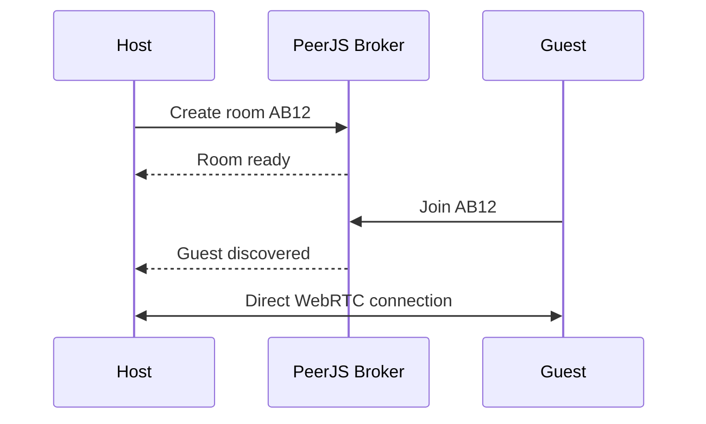

# 🎮 GameHub.io

> **Play free. Beat the AI. Challenge a friend.**

A fast, polished browser game arcade with **14 games**, AI opponents, local multiplayer, online room-code matches, browser saves and zero sign-up.

<div align="center">

[](https://parthgadge2025.github.io/GameHub.io/)
[](../../issues)
[](../../issues)


</div>

---

<div align="center">


</div>

## 🚀 About

**GameHub.io** is a free browser-based game hub. Every game runs in the browser with no account, download or paid server required.

Pick a game and play your way:

- 🤖 **Solo vs AI**
- 👥 **Two players on one PC**
- 🌐 **Online room-code multiplayer**
- 📱 **Touch-friendly games**
- 💾 **Automatic browser saves**
- 🌗 **Light / dark theme**

<div align="center">


</div>

---

## 🎮 Games

| # | Game | Category | Modes | How to play |
|---|---|---|---|---|
| 1 | ❌ **Tic-Tac-Toe** | Strategy | AI · 2P · Online | Get three in a row. AI uses minimax with occasional mistakes. |
| 2 | 🔴 **Connect Four** | Strategy | AI · 2P · Online | Drop discs and connect four horizontally, vertically or diagonally. |
| 3 | ✂️ **Rock Paper Scissors** | Strategy | AI · 2P · Online | Pick Rock, Paper or Scissors. Online choices reveal together. |
| 4 | 🔲 **Dots & Boxes** | Strategy | AI · 2P · Online | Draw lines, close boxes and score extra turns. |
| 5 | ✋ **Chopsticks** | Strategy | AI · 2P · Online | Attack hands, split fingers and knock out both opposing hands. |
| 6 | 🏓 **Pong** | Arcade | AI · 2P | W/S and Arrow Keys. First to 7 wins. |
| 7 | 🐍 **Snake** | Arcade | Solo | Eat, grow and avoid walls and yourself. |
| 8 | ⚡ **Reaction Time** | Arcade | Solo | Wait for green, click fast and save your best time. |
| 9 | 🐹 **Whack-a-Mole** | Arcade | Solo | Hit as many moles as possible in 30 seconds. |
| 10 | 🚀 **Space Shooter** | Shooting | Solo | Steer with keyboard, mouse or touch. Your ship fires automatically. |
| 11 | 🎯 **Target Practice** | Shooting | Solo | Hit shrinking targets for 30 seconds. |
| 12 | 🏎️ **Highway Rush** | Racing | Solo | Change lanes with arrows, A/D or touch. |
| 13 | 🧠 **Memory Match** | Puzzle | Solo · 2P | Find all 8 pairs. Matches keep your turn. |
| 14 | ☕ **Coffee Shop Sim** | Simulator | Solo | Price products, manage stock, hire staff and run the shop. |

---

## ☕ Coffee Shop Sim

Run a small coffee shop one day at a time.

- **Prices:** Espresso, Latte and Cappuccino
- **Stock:** beans and milk
- **Staff:** up to 4 baristas
- **Equipment:** grinder upgrades up to level 3
- **Opening hours:** 08:00–19:00
- **Rush hours:** 08:00, 09:00, 12:00, 13:00 and 17:00
- **Weather:** sunny, rainy and cold
- **Costs:** rent and wages
- **Progress:** automatically saved in the browser

Charge too much, run out of ingredients or lose too much cash and your reputation/business suffers.

---

## 🌐 Online Multiplayer

Compatible games use **PeerJS + WebRTC** for peer-to-peer play.



### How to play

1. Open a game with the 🌐 **Online** tag.
2. Choose **Create Room**.
3. Share the 4-letter code.
4. Your friend chooses **Join Room**.
5. Enter the code.
6. Play.

> Some school/office networks block WebRTC. If a connection fails, try another network or mobile data.

---

## ✨ Features

| Feature | Status |
|---|---|
| 🎴 Card game grid | ✅ |
| 🔎 Search | ✅ |
| 🏷️ Category tabs | ✅ |
| 🤖 AI opponents | ✅ |
| 👥 Local multiplayer | ✅ |
| 🌐 Online P2P multiplayer | ✅ |
| 🌗 Light / dark theme | ✅ |
| 💾 Browser auto-save | ✅ |
| 📱 Responsive design | ✅ |
| 👆 Touch controls | ✅ |
| ⌨️ Keyboard controls | ✅ |
| ♿ Accessibility support | ✅ |
| ⚡ Zero build step | ✅ |

---

## 📁 Project Structure

```text
GameHub.io/
├── index.html
├── README.md
└── assets/
    ├── banner.svg
    └── preview.svg
```

Both SVGs are intentionally self-contained and animated, so GitHub can render them directly without another image service.

---

## 🛠️ Run Locally

```bash
git clone https://github.com/parthgadge2025/GameHub.io.git
cd GameHub.io
npx serve .
```

Or open `index.html` directly.

---

## 🚀 Deploy

### Vercel

1. Push the project to GitHub.
2. Import the repository into Vercel.
3. Framework preset: **Other**.
4. Leave build command and output directory empty.
5. Deploy.

### GitHub Pages

Go to:

`Settings → Pages → Deploy from a branch → main → /(root)`

Live site:

**https://parthgadge2025.github.io/GameHub.io/**

---

## 🧩 Add Your Own Game

Add an entry to the `G` list:

```js
{
  n: 'My Game',
  i: '🎲',
  c: 'Arcade',
  m: ['solo'],
  d: 'One-line pitch.',
  s: myGame
}
```

Then define:

```js
function myGame(root, mode, net) {
  // Build your UI inside root.

  return () => {
    // Optional cleanup.
  };
}
```

Supported modes:

```text
solo
ai
duo
online
```

---

## 🗺️ Roadmap

### ✅ Done

- [x] 14 games
- [x] AI modes
- [x] Local multiplayer
- [x] Online room-code multiplayer
- [x] Peer-to-peer WebRTC
- [x] Search and categories
- [x] Light/dark theme
- [x] Responsive design
- [x] Touch controls
- [x] Browser saves
- [x] Accessibility features
- [x] Coffee Shop Simulator

### 🚧 Planned

- [ ] 2048
- [ ] Minesweeper
- [ ] Tetris
- [ ] Battleship
- [ ] Checkers
- [ ] Trivia Battle
- [ ] City Builder
- [ ] Farm Simulator
- [ ] Online Pong
- [ ] Leaderboards
- [ ] Achievements
- [ ] Daily challenges
- [ ] Player profiles
- [ ] Tournament mode

---

## 🧑‍💻 Built With

**HTML5 · CSS3 · Vanilla JavaScript · Canvas API · WebRTC · PeerJS**

No heavy framework. No required database. No paid backend.

---

## 🤝 Contributing

Found a bug or have a game idea?

- 🐛 [Report a bug](../../issues)
- 💡 [Request a game](../../issues)
- 🚀 Fork the repository and open a pull request

---

<div align="center">

## 🎮 Ready?

### [▶️ PLAY GAMEHUB.IO](https://parthgadge2025.github.io/GameHub.io/)

**14 Games · AI · Multiplayer · Online · Free**

<br>


<br>

**Made with ❤️ by Parth Gadge**

© 2026 Parth Gadge. All rights reserved.

</div>
